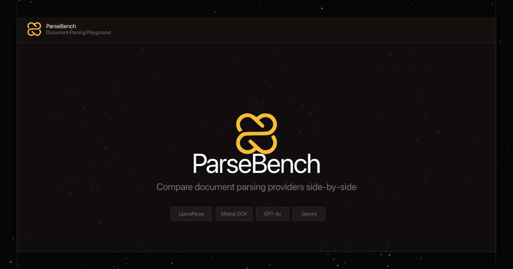

---

## Parsing is not the same as "vision"

When working with PDFs, scans, or screenshots, the first step is parsing: turning messy documents into clean, usable text (often with structure like tables, headings, and reading order). This step is easy to underestimate, but it's foundational. If parsing is wrong, everything built on top (search, extraction, automation, analytics, RAG) will be wrong too. And at scale, it's also expensive—so testing early matters.

There's been some confusion between:

* **Vision-capable LLMs** (GPT/Claude vision)
* **Specialized parsers** (LlamaParse, Mistral OCR, DataLab Marker)

They overlap, but they're built for different goals. Vision LLMs are great at interpreting and answering questions about an image. Specialized parsers are optimized for faithful extraction and consistent structured output (Markdown/JSON), especially on complex layouts like tables, multi-column pages, and forms.

**High-level architecture:**

* **Vision LLM:** document/image → model → response
* **Parser:** document → OCR + layout/structure → structured output → downstream use

To help people compare tools on real documents, we built a benchmark playground to test modern parsers side-by-side. No single tool wins everywhere—results depend a lot on the document type.

**What parsing tools are you using today, and what tends to break most often?**

---

```bash
bun install && bun dev
```

Open source. Clone it, fork it, bring your own API keys. [parsebench.crafter.run](https://parsebench.crafter.run)
